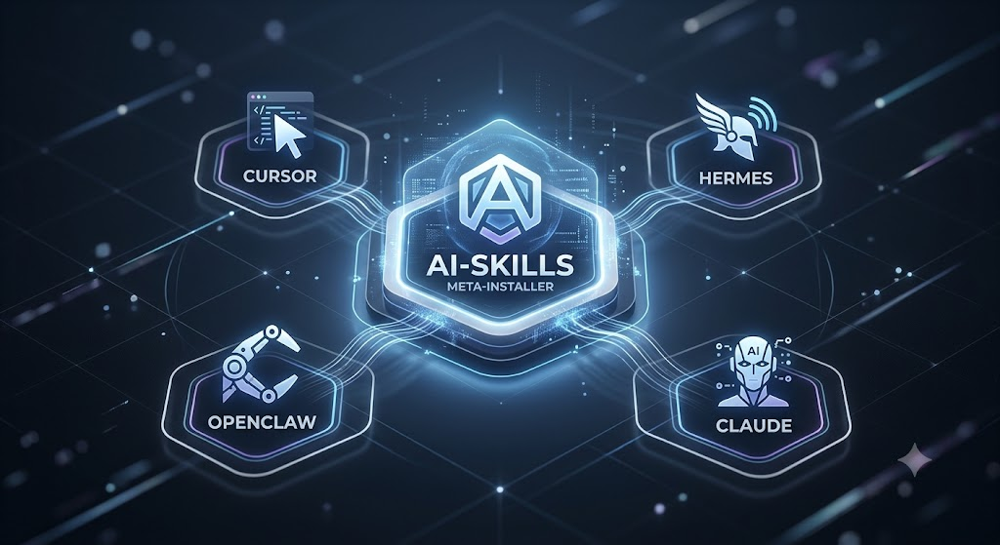

<div align="center">



# Meta-Skills

**Une librairie partagée de _skills_ CLI pour agents IA — installables sur Cursor, Claude, Hermes & OpenClaw.**

*par la communautes* · [github.com/Acher1234/Meta-Skills](https://github.com/Acher1234/Meta-Skills.git)

</div>

---

## 🧭 C'est quoi ?

**Meta-Skills** est une collection de _skills_ (scripts CLI shell / python / node) que les agents IA
peuvent utiliser, plus un **méta-installeur** qui les enregistre dans n'importe quel outil.

L'idée clé : **une seule librairie partagée + un seul environnement Python/npm** sur la machine.
On **ne re-clone pas** et on **ne réinstalle pas** les dépendances à chaque projet — le lourd vit
une fois, chaque outil ne reçoit que le `SKILL.md`.

| | |
|---|---|
| 🎯 **Multi-cibles** | Cursor · Claude · Hermes · OpenClaw *(OpenClaw en cours)* |
| 🌐 **Skills externes** | Peut installer **n'importe quel** repo git de skill, pas seulement ceux d'ici |
| ♻️ **Env partagé** | Un venv Python (`~/.meta-skills/.venv`) + npm global ; **chaque skill y installe ses propres deps** (une fois, pas par projet) |
| 📦 **Cache partagé** | Repos externes clonés **une fois** dans `~/.meta-skills/ext/` |

## 🏛️ Architecture

Le lourd est mutualisé sous `~/.meta-skills` ; chaque outil ne reçoit que le `SKILL.md`.

```
~/.meta-skills/                       librairie partagée ($META_SKILLS_HOME)
├── install.sh                      le méta-installeur (piloté par /meta-skills)
├── ext/<repo>/                     skills git externes, clonés UNE FOIS
|__ .venv/                          venv Python partagé (tous les skills python)

npm i -g <pkg>                      CLIs node globaux partagés (agent-browser, …)

        │ on ne copie QUE le SKILL.md vers chaque outil ↓
~/.cursor/skills/<name>/SKILL.md     ~/.claude/skills/<name>/SKILL.md
~/.hermes/skills/<name>/SKILL.md     ~/.openclaw/skills/<name>/SKILL.md
```

Chaque `SKILL.md` pointe vers son working dir sous `~/.meta-skills/…` : l'agent fait un  `cd` et exécute
le code / le venv installé **une seule fois**.

## 🚀 Installation

### 1. Cloner la librairie partagée (une fois)

```bash
git clone https://github.com/Acher1234/Meta-Skills.git ~/.meta-skills
cd ~/.meta-skills && ./setup.sh          # active le hook pre-commit (gitleaks)
```

### 2. Préparer l'environnement partagé

```bash
cd ~/.meta-skills
./install.sh --help     # rappelle les 3 commandes : fetch, pip init, npm init
```

### 3. Installer des skills

Colle le prompt d'installation dans un chat **Agent**, puis lance `/meta-skills`.
Le flux : **1)** choisir l'outil (Cursor / Claude / Hermes / OpenClaw) → **2)** la portée
(global / projet / profil) → **3)** ce qu'on installe (URL git externe, skill intégré, ou chemin local).

## 🪄 Méta-skills (installeurs)

| Méta-skill | Slash | Rôle |
|-----------|-------|------|
| `meta-skills` | `/meta-skills` | **L'installeur** : installe n'importe quel skill (git externe / intégré / local) sur **Cursor / Claude / Hermes / OpenClaw**, avec env Python/npm **partagé**. Voir [`SKILL.md`](SKILL.md) + [`install.sh`](install.sh). |

### `/meta-skills` — l'installeur

`install.sh` a **3 commandes** : `fetch`, `pip init`, `npm init`. Enregistrer un skill dans un
outil = un simple `cp` du `SKILL.md`.

```bash
cd ~/.meta-skills

# skill git externe → cloné UNE FOIS dans le cache partagé
SRC=$(./install.sh fetch https://github.com/some/cool-skill.git cool-skill)

# enregistrer = cp du SKILL.md vers l'outil (ici Claude global, puis Cursor projet)
mkdir -p ~/.claude/skills/cool-skill && cp "$SRC/SKILL.md" ~/.claude/skills/cool-skill/SKILL.md
mkdir -p ./.cursor/skills/cool-skill && cp "$SRC/SKILL.md" ./.cursor/skills/cool-skill/SKILL.md

# le skill installe SES deps tout seul (1re exécution) dans le venv partagé
./install.sh pip init "$SRC"                    # ou, depuis le dossier du skill : ./install.sh pip init .
```

> L'installeur **ne fait pas** de `pip install` pour toi : `fetch` (clone) + `cp` (register).
> Chaque skill installe **ses propres** dépendances via `pip init` / `npm init`, à son premier run,
> dans le venv partagé (`~/.meta-skills/.venv`) — une fois par machine, réutilisé par tous les projets.

| Cible (`tool` / `scope`) | Dossier d'install |
|--------------------------|-------------------|
| `cursor` / `global` | `~/.cursor/skills/<name>/` |
| `cursor` / `project` | `./.cursor/skills/<name>/` |
| `claude` / `global` | `~/.claude/skills/<name>/` |
| `claude` / `project` | `./.claude/skills/<name>/` |
| `hermes` / `all` | `~/.hermes/skills/<name>/` |
| `hermes` / `profile` | `${HERMES_HOME}/skills/<name>/` |
| `openclaw` / `global` | `~/.openclaw/skills/<name>/` *(WIP)* |
| `openclaw` / `project` | `./.openclaw/skills/<name>/` *(WIP)* |

> **Claude Code** est pleinement supporté (détection via `$CLAUDECODE`). **OpenClaw** reste
> **en cours d'implémentation** : ses chemins ci-dessus sont des valeurs par défaut qui pourront
> être ajustées quand ses conventions seront figées.

## 📦 Skills intégrés

**Racine (Meta-Skills)**


## 🔒 Sécurité — hooks git

Un hook `pre-commit` (`.githooks/`) lance **gitleaks** pour bloquer tout commit contenant une clé ou
un token. Active-le une fois après le clone :

```bash
./setup.sh
```

> `git` n'applique pas `core.hooksPath` automatiquement au clone (sécurité), d'où cette étape unique.
> `setup.sh` fait `git config core.hooksPath .githooks` et vérifie que `gitleaks` est installé.
> Détails : [`dependencies.md`](dependencies.md).

Les secrets vivent dans le `.env` de l'outil (`~/.cursor/.env`, `~/.claude/.env`, `$HERMES_HOME/.env`,
`~/.openclaw/.env`) — **jamais** dans un skill.

## 🧩 Créer un nouveau skill

Voir **[`SKILL_TEMPLATE.md`](SKILL_TEMPLATE.md)** (structure, `SKILL.md`, slash `/{skill}_{command}`,
conventions, sécurité). Chaque sous-projet contient :

- un **`SKILL.md`** (EN) — agent skill + actions `/{skill}_{command}` ;
- un **`README.md`** / **`README.fr.md`** ;
- un **`dependencies.md`** ;
- un **`config.example.json`**/**`.env.example`** (les vrais secrets sont gitignorés) ;
- le **script** exécutable.

Un skill Python doit cibler l'interpréteur **partagé** `~/.meta-skills/.venv/bin/python` plutôt qu'un
venv par projet.

---

*Maintenu par la communauté.*

> Version anglaise : [`README.md`](README.md)
